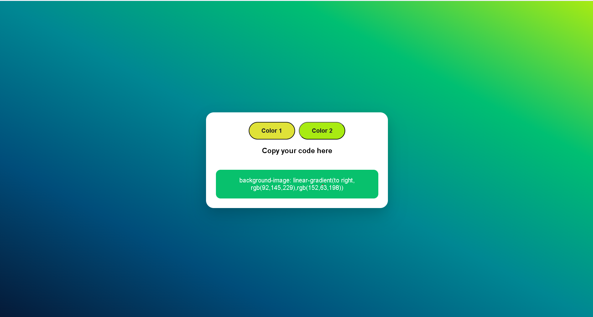

# 🎨 Project Gradient

A modern and responsive **Gradient Generator** built with **HTML5, CSS3, and JavaScript**. This application allows users to generate random linear gradients, preview them instantly, and copy the generated CSS code with a single click.

---

## 🔗 Live Demo

**Website:**  
https://sayan-5.github.io/Project-Grandient/

---

## 📸 Preview



---

# 📖 Overview

Project Gradient is a lightweight frontend web application designed to simplify the creation of beautiful CSS linear gradients.

The project demonstrates practical JavaScript concepts such as DOM manipulation, event handling, random color generation, Clipboard API integration, and responsive web design while maintaining a clean and modern user interface.

---

# ✨ Features

- 🎨 Generate random hexadecimal colors
- 🌈 Real-time linear gradient preview
- 📋 One-click CSS copy to clipboard
- ✅ Copy confirmation message
- 📱 Fully responsive design
- ⚡ Lightweight and fast
- 🎯 Clean, modern user interface
- 🌐 Hosted using GitHub Pages

---

# 🛠️ Built With

| Technology | Purpose |
|------------|---------|
| HTML5 | Structure |
| CSS3 | Styling & Responsive Design |
| JavaScript (ES6) | Functionality |
| Clipboard API | Copy CSS Code |
| Git | Version Control |
| GitHub | Repository Hosting |
| GitHub Pages | Deployment |

---

# 📂 Project Structure

```
Project-Grandient/
│
├── index.html
├── style.css
├── screenshot.png
└── README.md
```

---

# 🚀 Getting Started

### Clone the repository

```bash
git clone https://github.com/Sayan-5/Project-Grandient.git
```

### Navigate to the project

```bash
cd Project-Grandient
```

### Run the project

Simply open **index.html** in your preferred web browser.

---

# 💡 How It Works

1. Click **Color 1** to generate the first random color.
2. Click **Color 2** to generate the second random color.
3. The page background updates automatically with the new gradient.
4. Click the green CSS code box to copy the generated CSS.
5. Paste the copied code directly into your own project.

---

# 📚 Key Concepts Demonstrated

- DOM Manipulation
- Event Handling
- JavaScript Functions
- Random Color Generation
- CSS Linear Gradients
- Clipboard API
- Responsive Web Design
- Git & GitHub Workflow
- GitHub Pages Deployment

---

# 📱 Responsive Design

The application is fully responsive and optimized for:

- 💻 Desktop
- 💼 Laptop
- 📱 Mobile
- 📟 Tablet

---

# 🔮 Future Enhancements

- Gradient Direction Selector
- Custom Color Picker
- Gradient History
- Favorite Gradients
- Copy HEX Values
- Download Gradient as Image
- Dark / Light Theme
- Multiple Gradient Types (Radial & Conic)

---

# 👨‍💻 Author

**Sayan Singha**

- GitHub: https://github.com/Sayan-5

---

# ⭐ Show Your Support

If you found this project useful or interesting, please consider giving it a **⭐ Star** on GitHub.

It helps support the project and motivates future development.

---

## 📄 License

This project is licensed under the **MIT License**.