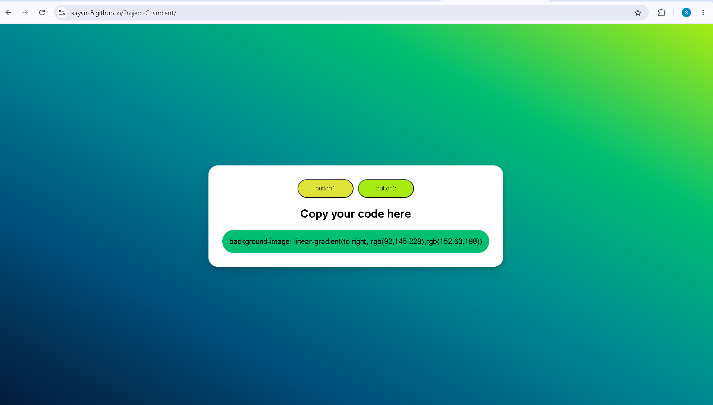

# 🎨 Project Gradient

A modern and interactive **Gradient Generator** built using **HTML, CSS, and JavaScript**. This project allows users to generate beautiful linear gradient backgrounds and instantly copy the CSS code for use in websites and web applications.

## 🌐 Live Demo

🔗 **https://sayan-5.github.io/Project-Grandient/**

---

## 📖 About the Project

Project Gradient is a beginner-friendly frontend project that demonstrates JavaScript DOM manipulation, event handling, and dynamic CSS generation. It provides an easy way to create random linear gradients while displaying the corresponding CSS code.

---

## ✨ Features

- 🎨 Generate random linear gradients
- 🖱️ One-click gradient generation
- 📋 Copy generated CSS code
- 📱 Responsive user interface
- ⚡ Fast and lightweight
- 💻 Beginner-friendly project

---

## 🛠️ Technologies Used

- HTML5
- CSS3
- JavaScript (ES6)

---

## 📁 Project Structure

```
Project-Grandient/
│
├── index.html
├── style.css
└── README.md
```

---

## 🚀 Getting Started

### Clone the Repository

```bash
git clone https://github.com/Sayan-5/Project-Grandient.git
```

### Open the Project

Navigate to the project folder and open `index.html` in your web browser.

---

## 🎯 Learning Outcomes

This project helped me understand:

- HTML page structure
- CSS styling and gradients
- JavaScript DOM Manipulation
- Event Listeners
- Dynamic CSS updates
- Git & GitHub
- GitHub Pages Deployment

---

## 🔮 Future Improvements

- Add Gradient Direction Selector
- Add Color Picker
- Save Favorite Gradients
- Gradient History
- Copy Success Notification
- Download Gradient as Image
- Dark/Light Mode

---

## 📸 Screenshot

Add a screenshot of your project here.

Example:

```
Project-Grandient/
│
├── screenshot.png
├── index.html
├── style.css
└── README.md
```

Then use:

```markdown

```

---

## 👨‍💻 Author

**Sayan Singha**

🎓 B.Tech in Information Technology  
🏫 University of Kalyani  
💻 Frontend Developer

### Connect with Me

- GitHub: https://github.com/Sayan-5

---

## 🤝 Contributing

Contributions, suggestions, and improvements are always welcome.

If you find any bugs or have ideas for new features, feel free to open an issue or submit a pull request.

---

## ⭐ Show Your Support

If you found this project helpful, please consider giving it a ⭐ on GitHub.

It motivates me to build more useful and exciting projects.

---

## 📄 License

This project is licensed under the **MIT License**.

---

### Thank you for visiting this repository! 😊